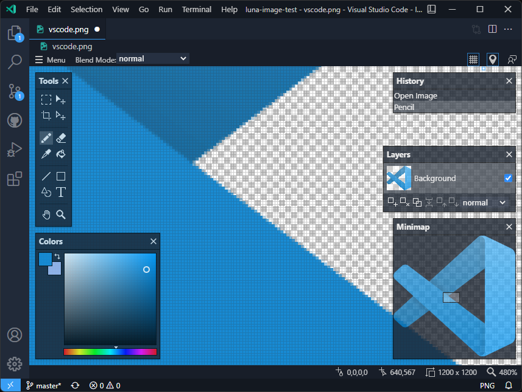

# Taille d'image 

<!-- note -->
## Luna Paint — Image Editor

{:width="500px" }
*Figure: Luna paint*

<!-- note -->

Luna Paint est une extension VS Code qui vous permet de modifier des images raster depuis l'éditeur, ouvrez simplement une image depuis l'explorateur et commencez à la modifier comme n'importe quel autre fichier.


- Nom: Luna Paint — Image Editor
  - Id: Tyriar.luna-paint
  - Description: Modifiez les images dans VS Code ! Prend en charge les formats png, jpg, webp, bmp, tga et ico.
  - VS Marketplace Lien : https://marketplace.visualstudio.com/items?itemName=Tyriar.luna-paint

<!-- note -->

## Example d'image en utilisant kramdown


```bash
{:width="500px"}
```


<!-- note -->

## Références

[Image Resize And Convert Tools](https://marketplace.visualstudio.com/items?itemName=GuusBeltman.ImageTools)
<br>
[Kramdown utilisation pour resize image](https://copyprogramming.com/howto/changing-image-size-in-markdown-on-gitlab#google_vignette)

<!-- note -->

