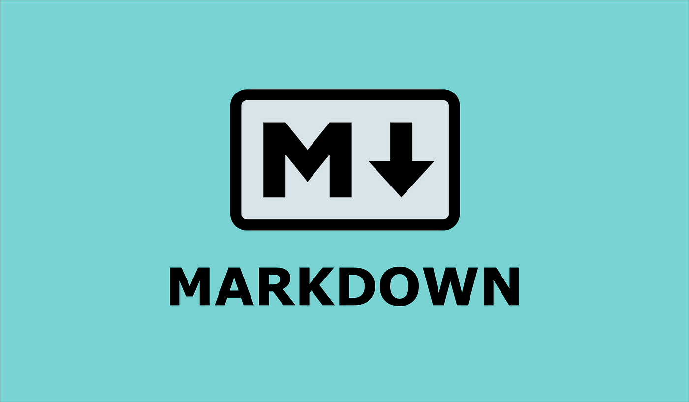

# Conclusion

{: width="400px" }
*Markdown*

En conclusion, Markdown offre une solution simple et efficace pour formater du texte de manière structurée et lisible, tout en permettant une conversion aisée vers différents formats tels que HTML ou PDF. Son utilisation répandue dans divers domaines, notamment l'édition de texte en ligne, le développement web et la documentation technique, témoigne de sa polyvalence et de sa praticité. Grâce à sa syntaxe intuitive et à sa facilité d'apprentissage, Markdown constitue un outil précieux pour les rédacteurs, les développeurs et toute personne cherchant à communiquer de manière claire et concise. En somme, Markdown demeure un choix incontournable pour la création de documents bien structurés et professionnels.
