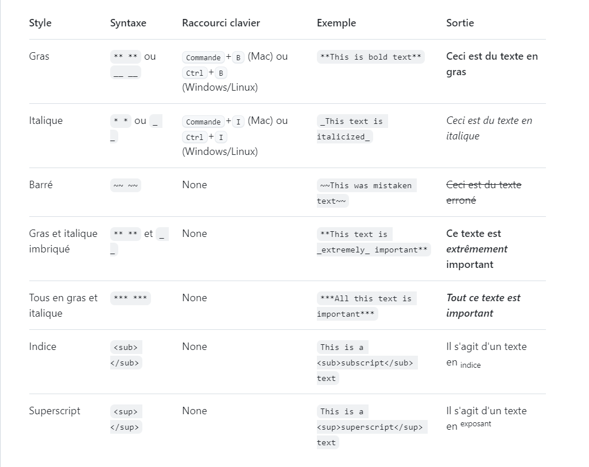

 
# Éxposer markdown
<!-- new slide -->

## Introduction

{:width="400px" }

<!-- new slide -->

## En-têtes

{:width="400px" }

<!-- new slide -->

## Style du texte

{:width="48%" }

<!-- new slide -->

## Lists

{:width="80%" }

<!-- new slide -->

## Tables

{:width="400px" }

<!-- new slide -->

## CheckBox

{:width="400px" }

<!-- new slide -->

## Quoting Text

{:width="400px" }
<!-- new slide -->

## Conclusion

{:width="400px" }