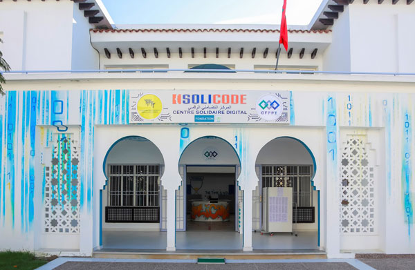

<!-- new slide -->

# Présentation de solicode

{: width="400px" }
*solicode tanger*

<!-- note -->

SOLICODE est un centre de formation pour les jeunes âgés de 18 à 34 ans spécialisé dans le développement Web et mobile. Les apprenants sont au cœur de leur propre processus d'apprentissage en réalisant des projets inspirés de l'environnement professionnel.

## Livrables

- [https://labs-web.github.io/lab-markdown/présentation-solicode/rapport.html](/lab-markdown/présentation-solicode/rapport.html)
- [https://labs-web.github.io/lab-markdown/présentation-solicode/presentation.html#/](/lab-markdown/présentation-solicode/presentation.html)
